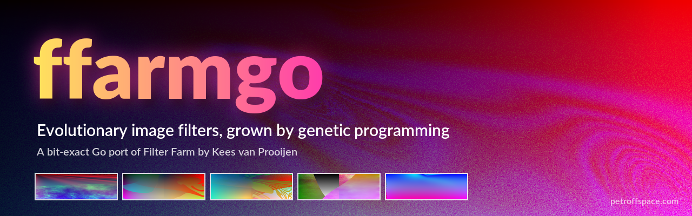

# ffarmgo



**ffarmgo** is a cross-platform port of **Filter Farm**, Kees van Prooijen's
evolutionary image filter for Adobe Photoshop, written in pure Go.

Filter Farm does not ship a fixed set of effects. It *grows* filters. Each
filter is a random expression tree built from a weighted grammar of
operators: noise, plasma fractals, blends, switches, curves and coordinate
warps. The tree's leaves read the source picture, so a filter warps,
recolours and textures the image it is applied to. You look at a grid of
nine filters, rate the ones you like, and breed the next generation. The
grammar learns from your ratings, and the filters drift toward your taste.

The port reproduces the original plugin **pixel for pixel**. It was
reverse-engineered from the plugin binary and is checked byte for byte
against renders made by the real plugin and by the plugin's own machine
code running in an emulator. You can open your old `.gdo` filters and
`.gds` sessions and get exactly the images Photoshop would.

## Credits

Filter Farm was created by **Kees van Prooijen**, an artist from the
Netherlands who lives in California and makes his art by programming
biologically inspired, "grown" models. Filter Farm (Windows Release 1.0,
© 1998–1999 Kees van Prooijen) is his attempt to formalize part of that
way of working: an environment where filters grow from genetic
information and evolve under the user's judgement.

- Kees van Prooijen: <https://www.kees.cc/>
- Filter Farm: <https://kees.cc/ffarm/ffarm.html>

All credit for the design of Filter Farm, its operators and its evolution
algorithm goes to him. ffarmgo is an independent port and is not
affiliated with or endorsed by Kees van Prooijen.

## Features

- **Bit-exact rendering** of Filter Farm `.gdo` filters and `.gds`
  sessions, including every operator, the noise and plasma generators,
  and x87 floating-point behaviour.
- **Evolution:** New Session and Breed work exactly as in the plugin's
  Farm dialog, with ratings from "favour" to "disfavour".
- **Browser front end** (`ffarmweb`) in place of the Photoshop dialog:
  - a 3×3 preview grid with rating sliders, Breed and Undo;
  - open and save sessions, export a cell as `.gdo`, or load a `.gdo`
    into a cell (drag and drop works);
  - upload a source image;
  - render to standard sizes (SD up to 8K) in many aspect ratios, and
    download the PNG;
  - apply a filter to a whole folder of images in place, in the
    background with progress and cancel;
  - autosave, so a restart picks up exactly where you left off.
- **Command-line tool** (`ffarm`) for scripting:
  - render a filter or a session cell;
  - batch whole folders (with subfolders);
  - create and breed sessions.
- **Image modes:** RGB, grayscale and CMYK, transparency, and selection
  masks.
- **Formats:** PNG, JPEG and GIF in; PNG or TIFF out (TIFF keeps CMYK).
- **Multi-core rendering:** Full HD in about a second on a modern
  desktop; the output is identical to a single-threaded render.
- **Runs anywhere Go does:** Linux, macOS, Windows and Raspberry Pi.
  There are no dependencies outside the Go standard library.

## Installation

You need **Go 1.26** or newer (<https://go.dev/dl/>). Unpack the release
archive and build:

```bash
git clone https://github.com/petroffspace/ffarmgo.git
cd ffarmgo
go build -o . ./cmd/...
```

The `...` has three dots: it means "every program under `cmd/`". The
command produces two programs in the current directory, `ffarm` and
`ffarmweb` (`ffarm.exe` and `ffarmweb.exe` on Windows).

To install them into `$(go env GOPATH)/bin` instead:

```bash
go install ./cmd/...
```

### Cross-compiling

Since the code is pure Go, you can build for another platform from any
machine. For example, for a Raspberry Pi 2 or 3 running a 32-bit OS:

```bash
CGO_ENABLED=0 GOOS=linux GOARCH=arm GOARM=7 \
  go build -trimpath -ldflags="-s -w" -o build-pi/ ./cmd/...
```

Use `GOARCH=arm64` for a 64-bit Pi OS, or `GOOS=windows` /
`GOOS=darwin` for Windows and macOS. The binaries are static: copy them
over and run them.

## Usage

### Browser front end

```bash
./ffarmweb -in photo.png
```

Then open <http://127.0.0.1:9797/>.

- The page shows nine filters applied to your picture. Move a cell's
  slider right to favour it or left to disfavour it, then press
  **Breed** (or B) for the next generation. **Undo** (or U) goes back.
- Click a picture to select that cell. Use **Full render** or the
  **Render** panel to produce a full-size result.
- Without `-in`, the program starts with a built-in gradient. You can
  upload a picture from the page at any time.
- To reach the page from another computer, listen on all interfaces:
  `./ffarmweb -addr 0.0.0.0:9797`. The server has no authentication, so
  only do this on a network you trust.
- The state is saved to `~/.local/state/ffarmweb` after every change.
  Use `-state ""` to turn this off.

All options:

```
-addr     listen address (default 127.0.0.1:9797)
-in       source image (PNG, JPEG or GIF)
-gds      session to open (default: the saved state, or a new session)
-grammar  file to keep the evolving grammar in
-state    directory for autosave ("" turns it off)
-size     the dialog's cell size stored in new cells (default 131x71)
-preview  largest preview size (default 320x240)
```

### Command line

Apply a filter to an image:

```bash
./ffarm -gdo filter.gdo -in photo.png -out result.png
./ffarm -gdo filter.gdo -in photo.png -mask selection.png -out result.png
./ffarm -gdo filter.gdo -in print.jpg -out result.tif   # CMYK JPEG → CMYK TIFF
```

A sample filter is included: `internal/farm/testdata/render.gdo`.

Work with sessions (a session is the 3×3 grid of nine filters):

```bash
./ffarm -new session.gds                                   # create a new session
./ffarm -gds session.gds -info                             # list its nine cells
./ffarm -gds session.gds -cell 3 -in photo.png -out r.png  # render cell 3
./ffarm -breed session.gds -rate 0=10,2=90 -out next.gds   # breed one generation
```

`-rate` sets each cell's slider from 0 (favour) to 100 (disfavour);
unrated cells stay at 50 (neutral). Add `-grammar g.json` to keep the
learned grammar between runs.

Filter a whole folder:

```bash
./ffarm -gds session.gds -in photos/ -out done/ -r
```

Every PNG, JPEG and GIF in the folder is rendered. `-r` includes
subfolders, `-overwrite` replaces existing outputs (they are skipped by
default, so an interrupted batch can be rerun), and `-tiff` writes TIFF.
Without `-out`, the results go to `photos/ffarm-out`.

Run `./ffarm -h` for every option.

### Notes

- A mask image works like a Photoshop selection: black is unselected,
  white fully selected, and grays partially selected.
- Grayscale images are filtered in Grayscale mode, CMYK JPEGs in CMYK
  mode, and everything else as RGB, just as Photoshop would.
- Rendering is CPU-heavy. Large images on small machines (like a
  Raspberry Pi) take a while, so start with small pictures.

## Development

```bash
go test ./...
```

The tests compare the port against vectors made with the original
plugin, byte for byte. The original plugin is not part of this release.
To run the full check against a real Photoshop render, or to use the
emulator tools in `tools/`, put `ffarm.8bf` and the reference render
`ffarm1.png` in a `real_plugin/` folder; without them,
`TestReferenceBitExact` is skipped. The disassembly that
`tools/listing.py` reads (`ffarm.decompiled`) is not included either. The details are in [docs/INTERNALS.md](docs/INTERNALS.md):

- the reverse-engineering notes;
- the `.gdo` and `.gds` file formats;
- the evolution algorithm;
- floating-point modelling;
- the emulator-based verification tools in `tools/`.

## License

ffarmgo is released under the [MIT License](LICENSE).

© 2026 [petroffspace.com](https://petroffspace.com)

The MIT License covers the ffarmgo source code. Filter Farm itself and
its name belong to Kees van Prooijen and are not covered by this
license. The original plugin is not distributed with ffarmgo; get it
from [his site](https://kees.cc/ffarm/ffarm.html).
